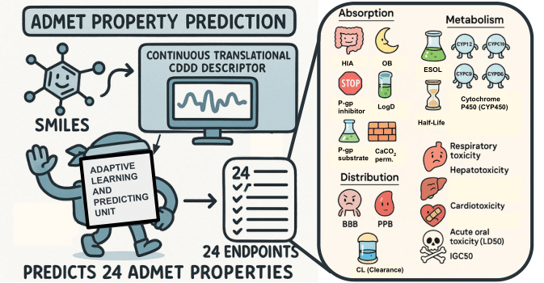

# MTAN-ADMET: A Multi-Task Adaptive Neural Network for Efficient and Accurate Prediction of ADMET Properties  

  

## 📖 Overview  
**MTAN-ADMET** is a deep learning framework for efficient and accurate prediction of ADMET (Absorption, Distribution, Metabolism, Excretion, and Toxicity) properties.  
It integrates **multi-task adaptive neural networks** with learned molecular embeddings to achieve state-of-the-art performance.  

This repository contains:  
- `data/` → datasets and generated embeddings  
- `envs/` → environment setup files  
- `notebooks/` → training, evaluation, and analysis notebooks  
- `plot_styles/` → plotting configurations  
- `scripts/` → utility scripts  

This software corresponds to the research article:  
> Shahid S, Maity D, Chakrabarty S. **MTAN-ADMET: A Multi-Task Adaptive Neural Network for Efficient and Accurate Prediction of ADMET Properties.** *ChemRxiv.* 2025; doi: [10.26434/chemrxiv-2025-zhrsk](https://doi.org/10.26434/chemrxiv-2025-zhrsk).  
> *(This content is a preprint and has not been peer-reviewed.)*  

Please refer to the paper for model details and methodology.  

---

## ⚙️ Installation  

### 1. Clone the repository  
```bash
git clone https://github.com/TeamSuman/MTAN-ADMET.git
cd MTAN-ADMET
````

### 2. Create environments

Two environments are required:

* **CDDD environment** (for generating embeddings)
* **MTAN-ADMET environment** (for training and evaluation)

```bash
# Create cddd environment
cd envs
conda env create -f cddd.yml
conda activate cddd

# Create mtan-admet environment
conda env create -f mtan_admet.yml
conda activate mtan_admet
```

---

## 🚀 Usage

### Step 1: Download the default model

The embeddings are generated using the pretrained sequence-to-sequence autoencoder by Winter et al.

> Winter, R.; Montanari, F.; Noé, F.; Clevert, D.-A. **Learning continuous and data-driven molecular descriptors by translating equivalent chemical representations.** *Chemical Science* 2019, 10, 1692–1701.

The pretrained model is available on Google Drive. Download and unzip by execuiting the bash script "download_default_model.sh":

```bash
cd scripts/cddd
./download_default_model.sh
```
The default_model.zip file can also be downloaded manualy under https://drive.google.com/open?id=1oyknOulq_j0w9kzOKKIHdTLo5HphT99h


### Step 2: Generate molecular embeddings

Activate the **cddd** environment and run:

```bash
conda activate cddd
jupyter notebook notebooks/test/embeddings_generator.ipynb
```

This produces:

* `data/admet_embeddings_clean.csv` → contains SMILES, groups, embeddings, and property values
* `data/embeddings_features.dat` → contains embeddings + labels (used for training)

---

### Step 3: Train the MTAN-ADMET model

Activate the **mtan-admet** environment and run:

```bash
conda activate mtan_admet
jupyter notebook notebooks/test/mtan_admet_run.ipynb
```

* Trains the adaptive neural network.
* Results can be evaluated within the notebook.
* Multiple runs can be performed by changing the random seed to collect performance statistics.

---

### Step 4: Baseline comparison

To compare MTAN-ADMET against other models:

```bash
jupyter notebook notebooks/test/baseline_analysis.ipynb
```

---

### Step 5: Dataset analysis

To analyze the ADMET dataset (collected from Du et al.):

> Du, B.-X.; Xu, Y.; Yiu, S.-M.; Yu, H.; Shi, J.-Y. **ADMET property prediction via multi-task graph learning under adaptive auxiliary task selection.** *iScience* 2023, 26, 108285.

```bash
jupyter notebook notebooks/analysis/Data_analysis.ipynb
```

---

## 📊 ADMET Properties Included

The MTAN-ADMET framework predicts the following properties:  

- HIA  
- OB  
- P-gp inhibitor  
- P-gp substrates  
- BBB  
- Respiratory toxicity  
- Hepatotoxicity  
- Half-life  
- CL (Clearance)  
- Cardiotoxicity (1 μM)  
- Cardiotoxicity (5 μM)  
- Cardiotoxicity (10 μM)  
- Cardiotoxicity (30 μM)  
- CYP1A2  
- CYP2C19  
- CYP2C9  
- CYP2D6  
- CYP3A4  
- Acute oral toxicity (LD50)  
- IGC50  
- ESOL (solubility)  
- logD  
- Caco-2 permeability  
- PPB (Plasma Protein Binding) 

---

## 📑 Citation

If you use this software, please cite:

```
Shahid S, Maity D, Chakrabarty S. 
MTAN-ADMET: A Multi-Task Adaptive Neural Network for Efficient and Accurate Prediction of ADMET Properties. 
ChemRxiv. 2025. doi:10.26434/chemrxiv-2025-zhrsk
```

